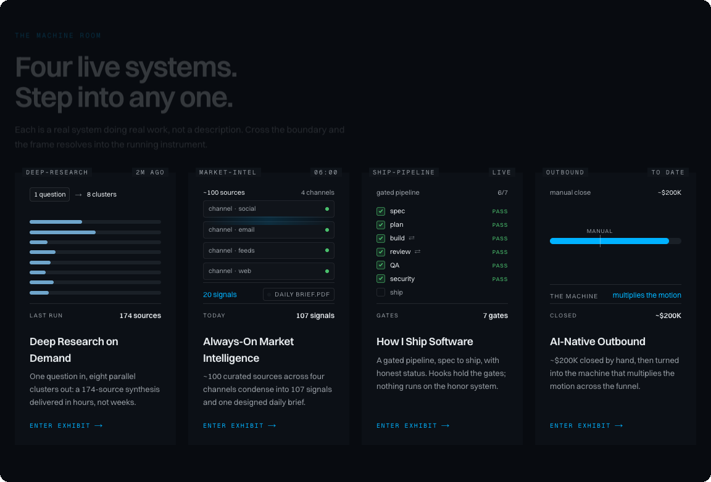

  

I close partnership revenue, then build the systems that multiply the motion. Four of them are live above.

**Exhibits** → [Deep Research](https://davidnguyen.io/research) · [Market Intelligence](https://davidnguyen.io/intelligence) · [Ship Pipeline](https://davidnguyen.io/build) · [Outbound](https://davidnguyen.io/outbound) 
**Open source** → [industry-pulse](https://github.com/thangnguyenworkspace/industry-pulse) · [research-engine](https://github.com/thangnguyenworkspace/research-engine)

---

### Track record

💰 **Head of Business Development · GFI Group · 2023 to 2025** 
Joined as an intern and was promoted to Head of BD within about two and a half years. Closed $220K+ in partnership revenue and grants with leading Layer-1 ecosystems, including Sui, NEAR, Polkadot, and Algorand, and built the function's internal tooling along the way: an Apps Script operations platform and an AI proposal workflow that cut proposal turnaround by roughly 70%.

🎤 **President · RMIT FinTech Club · 2022 to 2023** 
Led the executive team and the club's flagship FinTech Blockchain Forum, which drew 350+ attendees and speakers from Binance, OKX, Solana, and Dragon Capital.

🏆 **LotusHack 2026 · EdTech Track Runner-Up** 
Finished 7th overall out of 200+ teams, leading the front end and the presentation for a four-person team.

---

**Elsewhere:** [Full CV](https://davidnguyen.io/cv) · [davidnguyen.io](https://davidnguyen.io) · [LinkedIn](https://linkedin.com/in/nguyenvucongthang) · [thangnguyen.workspace@gmail.com](mailto:thangnguyen.workspace@gmail.com)
