  

Business development operator who builds his own GTM systems. I learned the revenue motion by running one, closing partnership deals from first touch to signature, and I build the agents that multiply it. Since late 2025 that has meant agentic outbound end to end: account research, intent detection, personalization, and outreach.

### Track record

- 💰 Intern to **Head of Business Development** in ~2.5 years; closed **$220K+** in partnership revenue and grants with leading Layer-1 ecosystems (Sui, NEAR, Polkadot, Algorand, and more).
- 🛠️ Built the tooling the BD function ran on: an **Apps Script operations platform** (project setup, dashboards, proposal and contract generation) and an **AI proposal workflow** that cut turnaround ~70% (3 to 4 days to same-day).
- 🎤 **President, RMIT FinTech Club**: led the flagship FinTech Blockchain Forum (350+ attendees; speakers from Binance, OKX, Solana, and Dragon Capital).
- 🏆 **LotusHack 2026**: EdTech track runner-up, 7th overall of 200+ teams (product and front-end lead).

---

**Elsewhere:** [Full CV](https://davidnguyen.io/cv) · [davidnguyen.io](https://davidnguyen.io) · [LinkedIn](https://linkedin.com/in/nguyenvucongthang) · [thangnguyen.workspace@gmail.com](mailto:thangnguyen.workspace@gmail.com)
