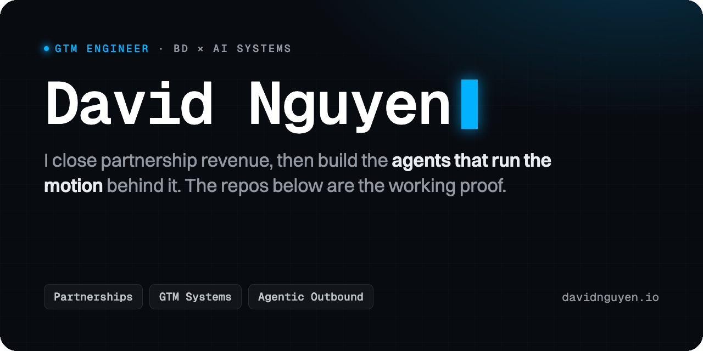

  

Business development operator who builds his own GTM systems. I learned the revenue motion by running one, closing partnership deals from first touch to signature, and I build the agents that multiply it. Since late 2025 that has meant agentic outbound end to end: account research, intent detection, personalization, and outreach.

### Track record

💰 **Head of Business Development · GFI Group · 2023 to 2025** 
Joined as an intern and was promoted to Head of BD within about two and a half years. Closed $220K+ in partnership revenue and grants with leading Layer-1 ecosystems, including Sui, NEAR, Polkadot, and Algorand, and built the function's internal tooling along the way: an Apps Script operations platform and an AI proposal workflow that cut proposal turnaround by roughly 70%.

🎤 **President · RMIT FinTech Club · 2022 to 2023** 
Led the executive team and the club's flagship FinTech Blockchain Forum, which drew 350+ attendees and speakers from Binance, OKX, Solana, and Dragon Capital.

🏆 **LotusHack 2026 · EdTech Track Runner-Up** 
Finished 7th overall out of 200+ teams, leading the front end and the presentation for a four-person team.

---

**Elsewhere:** [Full CV](https://davidnguyen.io/cv) · [davidnguyen.io](https://davidnguyen.io) · [LinkedIn](https://linkedin.com/in/nguyenvucongthang) · [thangnguyen.workspace@gmail.com](mailto:thangnguyen.workspace@gmail.com)
